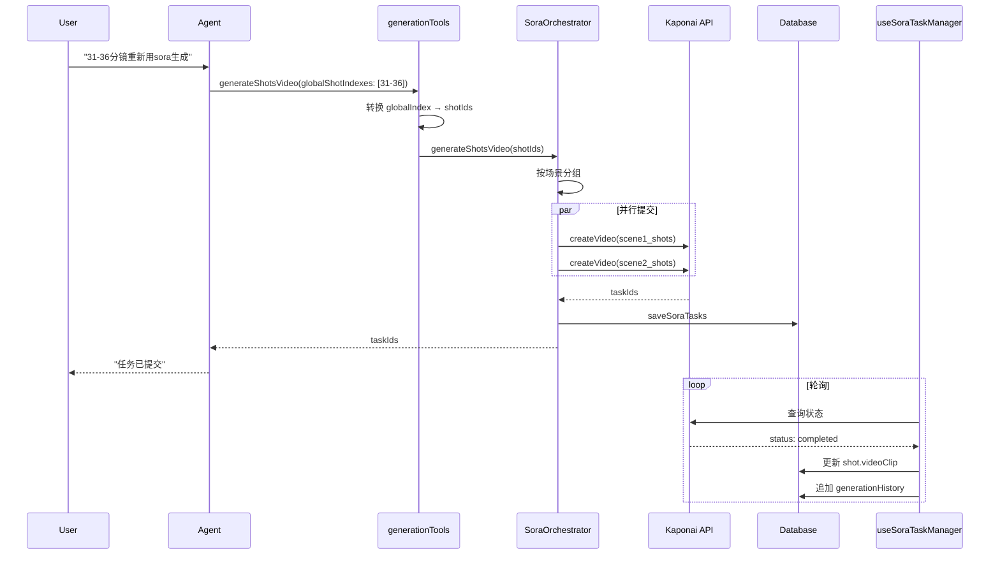

# Sora 视频生成 - 架构与流程文档 (v2.6)

本项目已成功集成 Sora2 视频生成能力。当前版本通过"动态比例识别"、"精简 JSON 剧本协议"与**全局 Prompt 后缀**，提升角色一致性与镜头质感，并支持**单任务覆盖多分镜**、**跨场景分镜并行处理**以及**Pro模式独立创作**。

---

## 1. 核心服务文件

| 服务 | 文件路径 | 职责 |
|------|----------|------|
| **SoraOrchestrator** | `src/services/SoraOrchestrator.ts` | 总导演：角色注册、场景拆分、任务编排、**并行任务提交** |
| **KaponaiService** | `src/services/KaponaiService.ts` | Sora API 底层封装 (创建视频、查询状态、下载) |
| **CharacterConsistencyService** | `src/services/CharacterConsistencyService.ts` | 角色参考视频生成与注册 |
| **SoraPromptService** | `src/services/SoraPromptService.ts` | Sora 专用提示词生成与角色码注入 |
| **useSoraTaskManager** | `src/hooks/useSoraTaskManager.ts` | **[New v2.6]** 统一任务管理 Hook |
| **ParallelExecutor** | `src/services/parallelExecutor.ts` | **[Updated v2.6]** Agent 工具并行执行引擎 |
| **generationTools** | `src/services/tools/generationTools.ts` | **[Updated v2.6]** 支持全局分镜序号转换 |

---

## 2. 架构图解

```mermaid
graph TD
    User[User / Agent] -->|Call| Orchestrator[SoraOrchestrator]
    ProUser[Pro Mode] -->|Direct Call| API[Kaponai API]
    
    Orchestrator -->|1. Init| DBService[UnifiedDataService]
    Orchestrator -->|2. Check| CharStatus{Char Registered?}
    
    CharStatus -->|No| CheckRef[Check Ref Image]
    CheckRef -->|Buffer: Detect Ratio| Reg[Kaponai: Create Ref Video]
    noteRef[Interactive Prompt:\n"Faces lens, speaks, white bg"] -.-> Reg
    Reg -->|Get ID| UpdateData[DB: Update soraIdentity]
    CharStatus -->|Yes| SplitLogic
    UpdateData --> SplitLogic
    
    SplitLogic{Scene > 15s?} -->|Yes| Chunk[Split into multiple Tasks\n Greedy Packing]
    SplitLogic -->|No| Pad[Padding Logic\n Min 10s, Max 15s]
    
    Chunk --> ShotConv
    Pad --> ShotConv
    
    ShotConv[convertShotToSoraShot] -->|3. Compile| JSON[Lean JSON Script + global_prompt]
    note[New Protocol:\nShotType + @ID Action + global_prompt] -.-> ShotConv
    
    JSON -->|4. Submit Parallel| API
    ProUser -->|Submit| API
    
    API -->|Task IDs| SaveTask[DB: Save Tasks\nsora_tasks + scene.soraGeneration]
    SaveTask --> Return[Return Task IDs]
    SaveTask --> TaskManager[useSoraTaskManager\nPolling + Auto Sync]
    TaskManager -->|Completed| R2[R2 Upload + Persist URL]
```

---

## 3. 核心流程

### 3.1 角色注册流程

```
1. 检查角色是否已有 @username
   ↓ (无)
2. 获取角色参考图 → 下载到临时文件
   ↓
3. 检测图片比例 (image-size)
   ↓
4. 生成参考视频 (Kaponai createVideo)
   - model: sora-2
   - seconds: 10
   - size: 根据图片比例选择 1280x720 或 720x1280
   ↓
5. 等待视频完成 (waitForCompletion) ⚠️ 阻塞调用
   ↓
6. 上传到 R2 持久化
   ↓
7. 注册角色 (Kaponai createCharacter)
   ↓
8. 获取 @username → 保存到数据库
```

### 3.2 视频生成流程 (Agent模式) **[Updated v2.6]**

```
1. 用户输入如 "31-36分镜重新用sora生成"
   ↓
2. Agent 解析 → 调用 generateShotsVideo 工具
   ↓
3. generationTools.generateShotsVideo 处理参数
   - globalShotIndexes: [31,32,33,34,35,36] → 转换为 shotIds
   - 自动提取 sceneId
   ↓
4. SoraOrchestrator.generateShotsVideo（支持跨场景）
   - 按 sceneId 分组 shotIds
   - 并行处理每个场景组
   ↓
5. generateVideoForShots（每个场景）
   - 识别涉及角色
   - 智能拆分 (splitShotsIntoChunks)
   - **并行提交所有 chunk 任务** (Promise.all)
   ↓
6. 保存任务 ID → 返回给 Agent
   ↓
7. useSoraTaskManager 轮询 → 自动同步到分镜
```

### 3.3 Pro模式生成流程

```
1. 用户输入提示词 (支持 @角色名)
   ↓
2. 自动替换角色码 (replaceSoraCharacterCodes)
   - 匹配 @角色名 或 角色全名 → 替换为 @sora_id
   ↓
3. 提交任务 (/api/sora/generate)
   ↓
4. 前端轮询任务状态
   ↓
5. 完成后在聊天显示视频
   ↓
6. 用户点击"应用到分镜" → 绑定到当前分镜
```

---

## 4. 关键设计决策

### 4.1 并行任务提交 **[New v2.6]**

**改进前**：串行 `for` 循环提交任务，7 个任务需要 2+ 分钟

**改进后**：使用 `Promise.all` 并行提交，7 个任务仅需 3-5 秒

```typescript
// SoraOrchestrator.ts - generateVideoForShots
const taskPromises = chunks.map(async (chunkShots, i) => {
    const task = await this.kaponai.createVideo({...});
    await this.dataService.saveSoraTask(soraTask);
    return task.id;
});
const taskIds = await Promise.all(taskPromises);
```

### 4.2 跨场景分镜支持 **[New v2.6]**

**场景**：用户指定 "31-36分镜"，但这些分镜跨越多个场景

**解决方案**：
```typescript
// SoraOrchestrator.generateShotsVideo
// 1. 按场景分组
const shotsByScene = new Map<string, Shot[]>();
for (const shotId of uniqueIds) {
    const shot = allShotsMap.get(shotId)!;
    shotsByScene.get(shot.sceneId)!.push(shot);
}

// 2. 并行处理每个场景
const results = await Promise.all(
    Array.from(shotsByScene.entries()).map(([sceneId, shots]) =>
        this.generateVideoForShots(project, scene, shots, userId, options)
    )
);
```

### 4.3 全局分镜序号支持 **[New v2.6]**

**问题**：用户使用全局序号（如 "31号分镜"），但 API 需要 shotId

**解决方案**（generationTools.ts）：
```typescript
// 按 globalOrder 排序所有 shots
const allShotsSorted = [...project.shots].sort((a, b) => 
    (a.globalOrder || a.order || 0) - (b.globalOrder || b.order || 0)
);

// globalShotIndexes: 从 1 开始的用户序号
finalShotIds = globalShotIndexes
    .map(idx => allShotsSorted[idx - 1]) // 转换为 0-indexed
    .filter(s => !!s)
    .map(s => s.id);
```

### 4.4 Agent 工具并行执行 **[Updated v2.6]**

**parallelExecutor.ts** 现在将以下工具归类为可并行执行：
- `generateShotsVideo` - 不同分镜范围可并行
- `generateSceneVideo` - 不同场景可并行
- `generateShotImage` - 不同镜头可并行

```typescript
const parallelizableByTarget = new Set([
    'generateShotsVideo',
    'generateSceneVideo',
    'generateShotImage',
]);
```

### 4.5 useSoraTaskManager Hook **[New v2.6]**

**职责**：统一 Sora 任务状态管理

```typescript
const {
    soraTasks,           // Map<taskId, SoraTask>
    soraTaskList,        // 排序后的任务列表
    taskCounts,          // { queued, processing, completed, failed }
    refreshTask,         // 刷新单个任务
    refreshAllTasks,     // 刷新所有任务
    bindTaskToShot,      // 绑定任务到分镜
    isLoading,
} = useSoraTaskManager({
    enablePolling: true,
    pollingInterval: 15000,
    autoSyncToShots: true,
});
```

**核心功能**：
- Map 键统一使用 `task.id`，避免状态错乱
- 提供 shotId → taskId 辅助索引
- 自动轮询进行中任务
- 完成后自动同步到分镜（含 generationHistory）

#### 4.5.1 任务应用状态显示 **[New v2.6]**

**文件**：`TimelineView.tsx` → `getTaskApplicationStatus`

Timeline 任务列表根据 `task.videoUrl` vs `shot.videoClip` 实时计算应用状态：

| 状态 | 徽章 | 含义 |
|------|------|------|
| full | ✓ 应用中（绿色）| 任务视频是所有覆盖分镜的当前版本 |
| partial | ⚡ 部分（黄色）| 任务视频是部分覆盖分镜的当前版本 |
| history | ○ 历史（灰色）| 任务视频不是任何分镜的当前版本 |

**视觉效果**：历史版本任务透明度 60%，hover 恢复。

#### 4.5.2 视频覆盖策略 **[New v2.6]**

**场景**：先生成 1-5 分镜，再生成 2-5 分镜

```
生成 1-5 后：分镜 1-5 → video_A
再生成 2-5 后：
- 分镜 1 → video_A（保持不变，因为任务 B 不包含它）
- 分镜 2-5 → video_B（被覆盖）

Timeline 显示：
- 任务 A: ⚡ 部分（只有分镜 1 在用）
- 任务 B: ✓ 应用中（分镜 2-5 都在用）
```

**核心原则**：只覆盖新任务 `shotIds` 中包含的分镜，未被包含的分镜保持原有视频。

### 4.6 动态比例双轨制

| 阶段 | 比例策略 | 目的 |
|------|----------|------|
| **角色注册** | 跟随**输入参考图**比例 | 确保角色特征不畸变 |
| **正片生成** | 跟随**项目全局设置**比例 | 确保成片符合视频规范 |

### 4.7 精简 JSON 协议 (Lean Protocol)

```json
{
  "character_setting": {
    "@abc123": { "appearance": "精灵少女，金色长发..." }
  },
  "shots": [
    {
      "action": "Shot Type: Close-Up. @abc123 凝视远方...",
      "camera": "Static",
      "dialogue": { "role": "@abc123", "text": "这就是命运吗？" },
      "duration": 5,
      "location": "森林",
      "style_tags": "cinematic",
      "time": "Day"
    }
  ],
  "global_prompt": "中文配音，不要增减旁白，无字幕，高清，无配乐，画面无闪烁。"
}
```

### 4.8 时长策略

| 场景时长 | 处理方式 |
|----------|----------|
| < 8s 且单镜头 | 生成 10s 视频 |
| 8-15s | 生成 15s 视频 |
| > 15s | Greedy Packing 拆分为多段 |

---

## 5. API 端点

| 端点 | 方法 | 功能 |
|------|------|------|
| `/api/agent/tools/execute` | POST | Agent 触发 Sora 编排入口 |
| `/api/sora/generate` | POST | Pro模式直接生成入口 |
| `/api/sora/status` | GET | 查询任务状态 |
| `/api/sora/status/batch` | POST | 批量查询/刷新任务状态 |
| `/api/sora/tasks` | GET | 查询分镜已完成视频 |
| `/api/sora/tasks/list` | GET | 查询项目 Sora 任务列表 |
| `/api/sora/tasks/backfill` | POST | 回填任务到 `sora_tasks` |
| `/api/sora/character/register` | POST | 角色注册 |
| `/api/sora/character/status` | GET | 查询角色注册状态 |

---

## 6. 数据流图 **[New v2.6]**



---

## 7. ⚠️ 部署注意

**Vercel Serverless 限制**：

| 问题 | 说明 |
|------|------|
| 阻塞调用 | 角色注册 `waitForCompletion` 可能超时 |
| 文件系统 | 依赖 `/tmp` 目录 |

**建议**：使用容器化部署 (Railway, Zeabur) 或任务队列

---

## 8. 版本历史

| 版本 | 日期 | 变更 |
|------|------|------|
| v2.6 | 2026-01-13 | 并行任务提交、跨场景分镜、useSoraTaskManager、Agent工具并行、任务应用状态显示 |
| v2.5 | 2026-01-12 | 视频历史 Hook、实时加载 |
| v2.4 | 2026-01-10 | 数据同步、Markdown 支持 |
| v2.3 | 2026-01-08 | 多镜头覆盖、版本管理 |

---

**最后更新**: 2026-01-13
**版本**: v2.6

